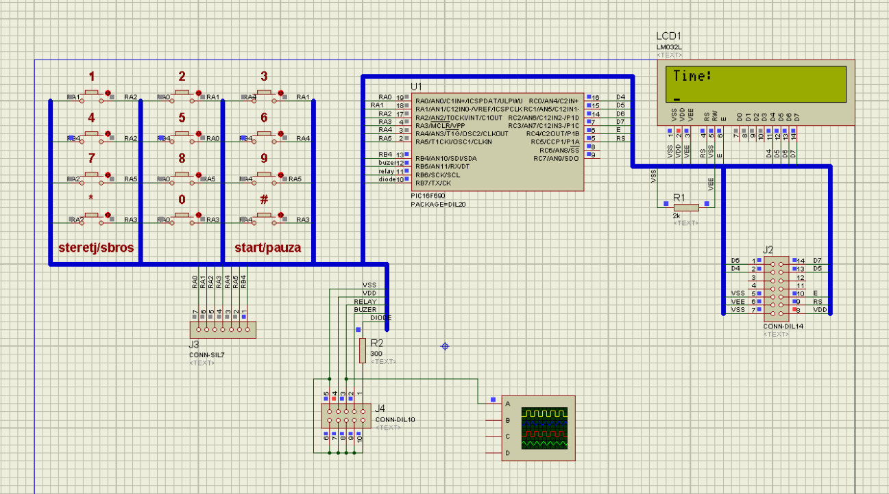
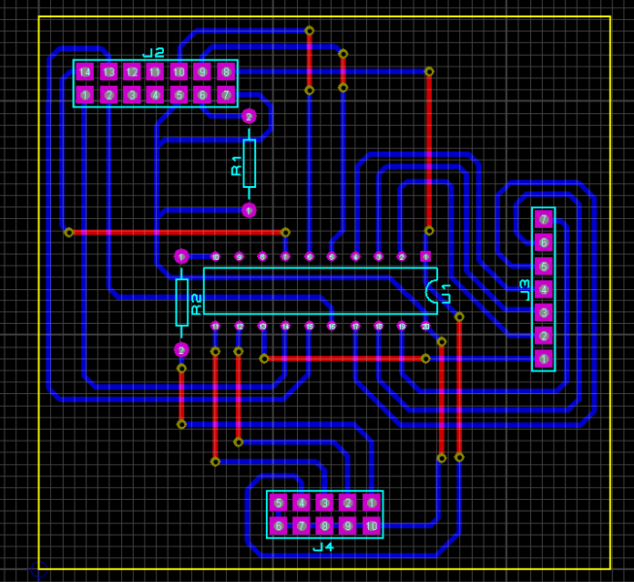
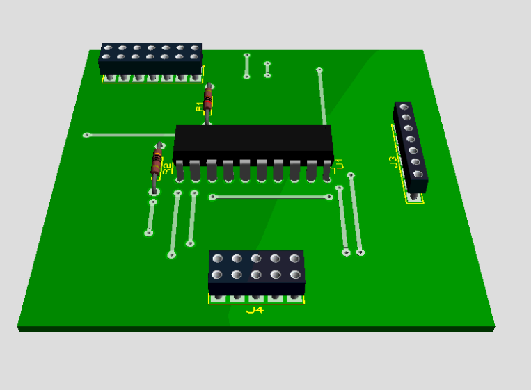

# Photoresist UV exposition device for PCB boards.

 <!-- .element height="10%" width="10%" -->


#### Stack:

- MCU           : PIC16F690 
- IDE           : MPLAB 8.76
- Programmator  : PickIt 2
- PCB Design    : Proteus (ISIS and ARES) 
- Firmware      : HiTech C

#### Description:

Hi there :)

This project started in approx. 2012, when I was a student, and was about creating UV exposition device for PCB boards.
 
Device consists of two boards : power board and control board. Also it has 6 UV (black light) lamps, 8 Watts each, 
stored in the enclosure of old scanner.  

Power board consists of :

- 220v -> 12v transformer,
- diode bridge,
- capacitor,
- relay,
- protection diode for relay,
- transistor for relay,
- voltage stabiliser for 5V and caps for it.

Board itself is hidden inside of main (scanner) enclosure.

Control board consists of :

- LCD display 8x2 ,
- Microchip PIC16F690 mcu,
- 4x3 keypad ,
- stuff like led, buzzer and communication sockets.

All this were stored in small white box, that is attached to the main enclosure from the side. 

The code of firmware is written in C language and is total garbage. However I decided not to refactor it, because it 
reminds me about my youthfulness :). 

The same I could say about power board circuit diagram :)).

Nevertheless device is fully functioning and did a great job for all this period of time.

#### Photos:

You can check more photos in ```photos``` dir.

 <!-- .element height="10%" width="10%" -->

 <!-- .element height="10%" width="10%" -->

 <!-- .element height="10%" width="10%" -->

 <!-- .element height="10%" width="10%" -->
