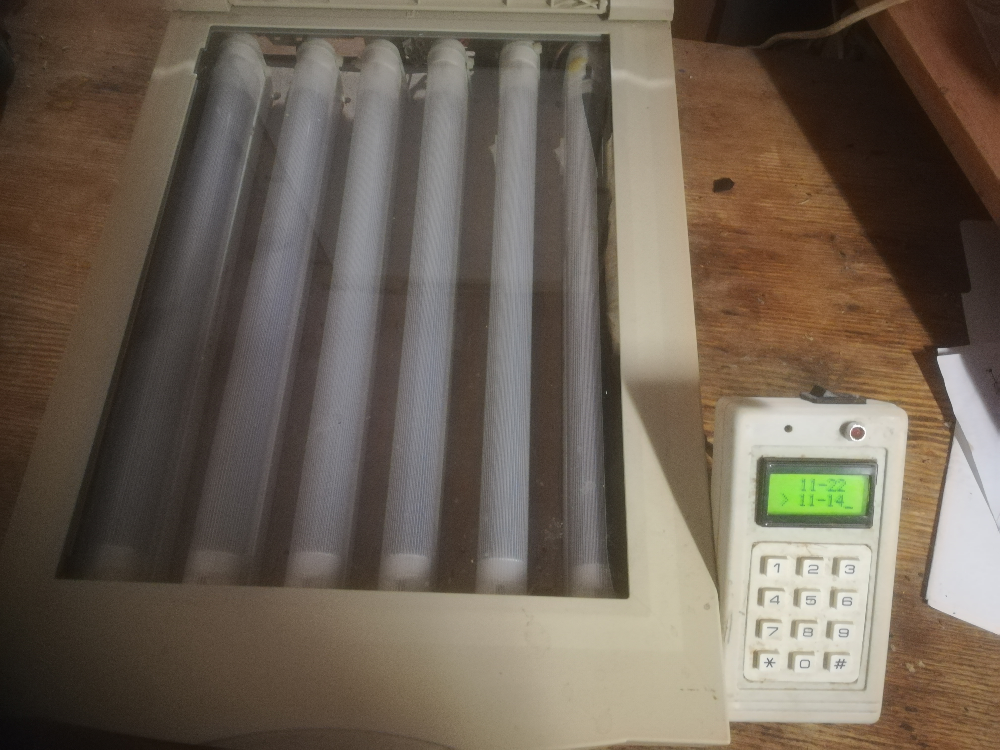

# Photoresist UV exposition device for PCB boards.

 <!-- .element height="10%" width="10%" -->

#### Stack:

- MCU           : PIC16F690 
- IDE           : MPLAB 8.76
- Programmator  : PickIt 2
- PCB Design    : Proteus (ISIS and ARES) 
- Firmware      : HiTech C

#### Description:

#### Photos:

 <!-- .element height="10%" width="10%" -->

 <!-- .element height="10%" width="10%" -->

 <!-- .element height="10%" width="10%" -->

 <!-- .element height="10%" width="10%" -->
